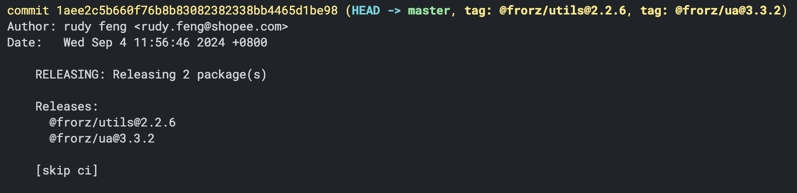
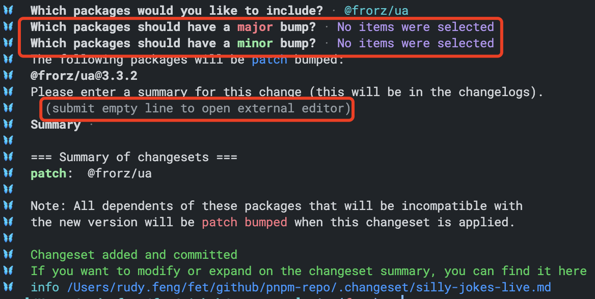
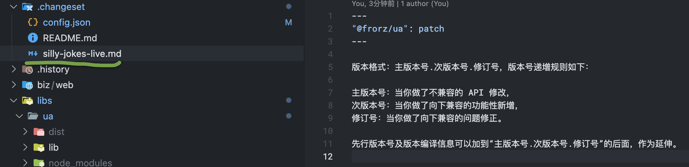
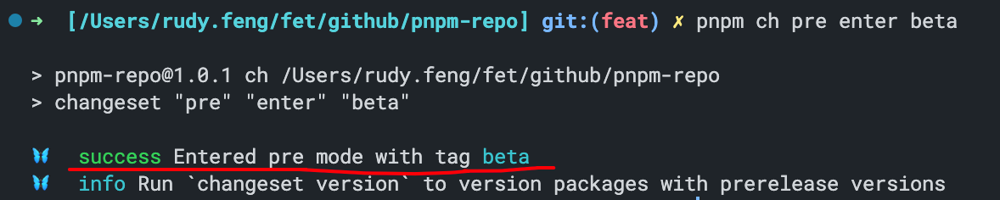
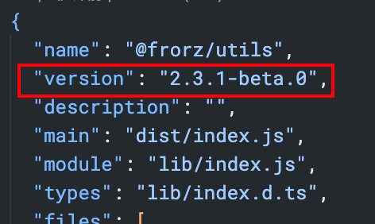
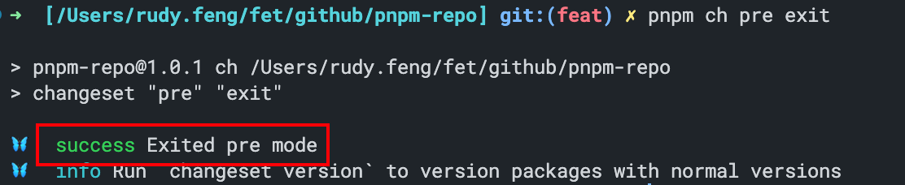
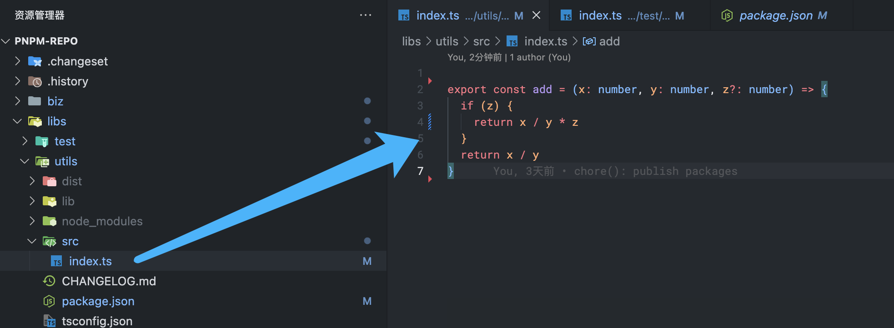
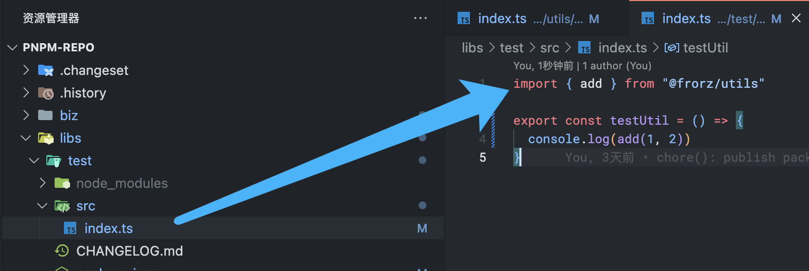
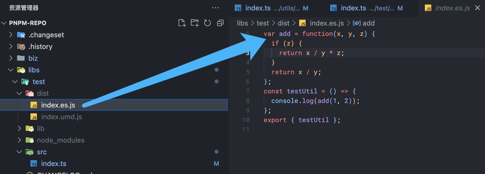

多包管理，pnpm 管理依赖，changesets 管理发布

这种模式适合应用在纯物料 monorepo，如果还有业务代码则不适用

# pnpm

[pnpm](https://pnpm.io/)

[Why should we use pnpm?](https://medium.com/pnpm/why-should-we-use-pnpm-75ca4bfe7d93)

[pnpm's strictness helps to avoid silly bugs](https://www.kochan.io/nodejs/pnpms-strictness-helps-to-avoid-silly-bugs.html#disqus_thread)

[pnpm 作者主页](https://medium.com/@zoltankochan)

[lerna](https://github.com/lerna/lerna/tree/main/commands/publish)

# changesets

发布已经封装在 `scripts/changeset.js` 中，非 master 会构建测试版本


介绍

> A tool to manage versioning and changelogs with a focus on multi-package repositories

上面这句话是 changesets 最直观的介绍，可知，它就是设计用来管理 monorepo 的版本控制和发布记录。与此同时，他的变更集（changeset）以符合  semver bump types 的形式发布一组 packages

changesets 提供了一个 cli 工具来方便写入及消费变更集，我们只需要安装这一个工具即可

## 优点

1.自动化版本管理：

- 生成版本号：根据提交的变化自动生成版本号，确保版本号符合语义化版本控制（SemVer）规范。

- 变更日志：自动生成和更新变更日志，记录每个版本中的更改。

2.精确的版本更新：

- 细粒度更新：只更新受影响的包的版本，避免不必要的版本更改，提高发布的精确度和可靠性。

3.简洁易用：

- 配置、集成都相对简单，学习成本很低

与 lerna 相比

- 更好的 CHANGELOG：
- 每个变更集记录了具体的更改信息和影响的包，从而提供了明确的版本管理和更新记录。
- 更好的兼容性处理：
- changesets 的变更集机制可以在处理 breaking change 时提供更好的版本管理和兼容性支持。
- 更简洁易用

## 工作流程

**dev**: 增加变成集（changeset），提交

**maintainer**: 消费变更集（changeset），发布

## 安装
```bash
pnpm i @changesets/cli -wD
```
## 初始化

```bash
pnpm changeset init
```

该命令会在项目跟目录下生成一个 `.changeset` 文件夹，注意哦，这个文件夹是需要提交的。`.changeset` 中有两个文件

- config.json
- README.json

README.json 不必多说了，先简单看一下 config.json 的内容吧！

## .changeset/config.json

```json
{
  "$schema": "https://unpkg.com/@changesets/config@3.0.2/schema.json",
  "changelog": "@changesets/cli/changelog",
  "commit": true,
  "linked": [],
  "access": "public",
  "baseBranch": "master",
  "updateInternalDependencies": "patch",
  "ignore": []
}
```

我们挑几个常用的配置来介绍

### commit

在使用了 changeset add 和 changeset version 之后是否自动生成一条提交信息，默认为 false. 如果为 true 则会使用 cli 的内置包来生成 commit msg， 格式如下



也可以使用自定义脚本，这里不赘述，目前对这方面没有太多要求

### access

发布的包为私有还是公共的，默认为 restricted ，这是为了防止意外的公布代码。但多数情况下我们会设置为 public 

### baseBranch

指明和哪个分支进行对比变更，设置为 master 即可

### updateInternalDependencies

该选项设置当所依赖的包发生变化时，是否应该更新它所依赖的版本。可选的值有minor, patch。代表的意思是，只有依赖的包的相应版本变更时，才同步更新本包依赖的版本。如以下结构

```bash
pkg-a @ version 1.0.0
pkg-b @ version 1.0.0
  depends on pkg-a at range `^1.0.0
```

如果该配置值为 patch，那当 我们同时为 pkg-a，pkg-b 发布了一个 patch 版本，那么最终的更新结果为

```bash
pkg-a @ version 1.0.1
pkg-b @ version 1.0.1
  depends on pkg-a at range `^1.0.1
```

如果该配置值为 minor, 但如果我们同时为 pkg-a，pkg-b 发布了一个 patch 版本，那么更新结果则为

```bash
pkg-a @ version 1.0.1
pkg-b @ version 1.0.1
  depends on pkg-a at range `^1.0.0 // 这里没有发生变化
```

但需要注意的是，上面我都强调了 “同时” 两个字。也就是说，这是该配置的应用条件

如果仅仅发布 pkg-a 的话，那么 pkg-b 中依赖的 pkg-a 的版本则完全根据版本前缀 ^ ~ * 的规则来。以 ^ 举例，分 1.x.x 和 0.x.x 两种情况

**1.x.x**

只有 ^1.0.0 不再匹配最新的 pkg-a 版本（2.x）时，pkg-b 才会同步更新该依赖的版本并发布新版本

**0.x.x**

对于 0.x.x 的版本号，只要 pkg-a 发布了新版本，那么 pkg-b 也会同步更新依赖以及发布新版本

### ignore

如果一个 monorepo 中均为 npm 包，则无需关注此字段。但是我们的 monorepo 项目还有 biz 业务代码，因此可以在这里进行忽略，但该数组不是文件夹的名称，而是 package.json 中的 name 字段。如 ignore: [ 'creator-center', 'admin' ]

## 增加变更集
**changeset  /  changeset add **

该命令执行后会出现一个 prompt 让用户选择要发布的 package，如下图所示，changeset 会对比和 baseBranch 的变动将 packages 分为 changed 和 unchanged，使用空格进行选择即可


选择完成之后，会有另一个 prompt 来确定要更新 major, minor 或 patch 版本。按 enter 可以跳过，进入下一个版本的选择。其中 Summary 是 CHANGELOG 中的信息，尽可能将变更内容书写在这里。如果你有很多的 Summary 要写，设置需要换行，那么可以直接 enter 进入 vim 模式进行编写。




执行结果是什么？




`pnpm changeset` 执行过后，会在 `.changeset` 文件夹中生成一个随机名称的 .md 文件，内容就是本次修改的 package name，更新的版本种类以及 Summary。所有生成的东西我们都可以进行手动修改，因此如果 Summary 感觉书写麻烦，也可以直接在 .md 文件中修改

该文件是用来给 changeset version  消耗的，执行过后该文件就会被删除掉

## 发布

对于 package 的开发同学来说，增加变更集之后，工作就已经结束了，我们需要将新增的变更集并入 master，由 maintainer 来进行发布。发布分为以下两步

### changeset version

该命令做以下三件事

- 消耗掉新增的变更集（如果同一个 package 有多个变更集，则会合并处理，选择版本更高的发布）
- 修改当前包的 version，以及上游依赖方所依赖的该包的版本（如有必要）
- 将本次 pnpm changeset 时的 Summary 写入该包的 CHANGELOG 中 （如没有则会创建新的）

值得一提的是，**我们最好在执行完该命令后，将该命令产生的所有修改提交到 master 中**

### changeset publish

将最终的修改提交到 registry 中，在执行完 changeset version 并提交之后，publish 之前，不应该再有任何修改了。该命令结束后，将我们的修改推到远端即可 

```bash
git push origin HEAD
```

到此，整个发布流程就结束了。

需要特别强调的是，开发同学不应该在 feature 分支上发布正式版本

## 发布测试版本

发布测试版本是一个相对复杂的过程，使用的是 pre 命令。需要先进入 prerelease 模式，当我们修改完所有操作之后，再推出 prerelease 模式。这很类似于 vim 的编辑模式和视图模式，以及 canvas 的 store 和 restore 方法。接下来我们就尝试发布一个测试版本的包来看看流程吧。（以下演示中使用的 ch 是我配置的 changeset 的别名）

1、进入 prerelease 模式

changeset pre enter beta  最后的这个 beta 是可更换的，如 alpha 也是可以的



2、发布测试包

提示该信息就表明我们已经在 prerelease 模式了。之后的流程和发布正式包没有区别，但是在版本号上会增加 beta 标识




在 prelease 模式下我们可以随意发布 beta 包，数量不限，且不需要提交代码。

3、退出 prerelease 模式

当最终确认本次修改没有问题之后，执行 changeset pre exit 退出 prerelease 模式即可。接下来就需要提交 changeset 到 master，然后有 maintainer 进行发布了




## 为什么要一同更新相关依赖包的版本？

1、pkg A 依赖 pkg B 的某个特定版本。如果 pkg A 需要 pkg B 的新功能或修复，pkg B 的发布可能需要将 pkg A 一同更新到新版本。这里最好结合 updateInternalDependencies 配置的解释理解

2、如果pkg B 的 breaking change 影响了 pkg A，那么 pkg A 应该更新版本。语义化版本控制（SemVer）要求，在依赖的包发生 breaking change 时，依赖该包的其他包也需要反映这种变化。pkg A 可以发布一个新版本以适配 pkg B 的 breaking change。尽管这可能会对 pkg A 造成一些兼容问题，或许要做一些必要性的更新，但这是合适的做法，可以让 pkg A 的用户知道它已经适配了 pkg B 的新版本。再换一种说法， 如果 B 的breaking change 累计了很多个，那么 A 更新起来则更灾难。

changesets自身还存在什么问题？
- 生成的 changeset 名称是随机的，无法知道是谁修改的那个包。该问题并不确定会有什么影响，处理优先级并不高
- prerelease 的流程相对繁琐，但我们可以通过自定义脚本进行包装 prerelease 和 public
- 仍无法限制在 master 上发布正式包，靠的是人为，该部分只能强制按流程处理
- 多人开发同一个包，在本地发布测试版本时，可能会造成版本冲突。比如 A 同学已经发布了 beta-0，B 同学那边也是从 beta-0 开始发布就会失败。


# doc

## PNPM

pnpm 内置了对 workspace 的支持，这就意味着我们可以方便的使用本地包，而无需再进行 npm link 等诸如此类的费神操作。且在 打包问题 提到的也不再是问题了。接下来简单看看吧

## 配置

A workspace must have a pnpm-workspace.yaml file in its root. A workspace also may have an .npmrc in its root.

## .npmrc

这些配置保证了我们安装包的时候从本地进行安装，并且使用 workspace: 协议， 需要注意的是，如果本地没有这个包的话，安装过程中会报错

```bash
#If this is enabled, local packages from the workspace are preferred over packages from the registry, even if there is a newer version of the package in the registry.
#This setting is only useful if the workspace doesn't use save-workspace-protocol.
prefer-workspace-packages = false
 
# If this is enabled, locally available packages are linked to node_modules instead of being downloaded from the registry.
link-workspace-packages = true
 
# use workspace: protocol when install dependency. defalt: true
save-workspace-protocol = true
 
registry="https://registry.npmjs.org"
```


## pnpm-workspace.yaml

该配置允许我们定义 workspace 中的那些目录被包含/排除。默认情况下包含根目录下所有子文件夹

```bash
packages:
  - 'libs/**'
```

## 安装应用

目前我的应用目录为

```bash
.
└── monorepo
    ├── libs
    │   ├── test
    │   │   └── package.json
              "dependencies": {
                "@frorz/utils-pkg": "workspace:*"
              }
    │   └── utils
    │       └── package.json
    ├── .npmrc
    ├── package.json
    └── pnpm-workspace.yaml
```


当我发布到注册表之后，会自动去掉 workspace: 协议。

因此，可以正常使用本地 workspace 中的 packages，而不需要其它中间步骤。包的使用者也可以像常规的包那样正常使用，且仍然可以受益于语义化版本。不过通常我们可以直接使用 workspace:* 这样就可以引用本地的任何版本了

## 打包

现在，我在 utils 里面新增一个方法，并且在 test 中引入这个方法，我们看看打包结果中是否有最新的代码






接下来我执行 `pnpm --filter "@frorz/* build"` 对所有的包进行构建（因为依赖的是本地包，因此需要先将所依赖的 utils 打包， 否则 test 无法找到引用资源），我们看到 test 包的构建结果中已经有 utils 包中的最新方法了，那么发布功能就可以完全独立出去，专注发布了




这里顺便再提一句 semver 范围应用的事情（这与本文无关，完全是题外话）比如我们安装一个包 foo 的时候，它的版本是 2.1.5， 我们的依赖中用的是 ^2.1.5, 那么安装完之后，lock 文件中就会记录这个包的保本，即便此包已经更新到 2.1.9 版本了，那么我们 install 的时候也依然会先去看缓存和 lock 文件中的版本（如果 package.json 未曾改动的话），也就是说仍会应用 2.1.5 版本。

即： 只有在删除了 lock 文件之后， ^ ~ * 这些 semver 返回才能发挥原本的功效

## 使用构建前的资源

如果我本地调试的时候需要修改 utils，但是不想每次都打包，该怎么办呢？

这里有两个问题需要考虑

- 类型检查
- 包的实际引用地址

类型检查部分：因为 utils 包的类型声明目录位于 `utils/lib/index.d.ts` 中，但我们尚未打包，因此找不到 utils 的类型声明，那么可以在 tsconfig 中增加一个配置

```json
{
 	"paths": {
  		"@frorz/*": ["../*/src"],
	}
}
```

实际引用部分：可以给 test 包增加一个如下配置（如果你用的是 rollup）

```ts
alias({
  entries: [
    {
      find: /^@frorz\/([^/]+)/,
      replacement: path.resolve(__dirname, `../$1/`),
    },
  ],
})
```

当然这不用每次都改，只要增加一个环境变量或者命令来控制就好了